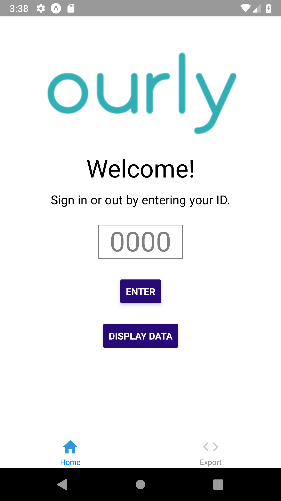
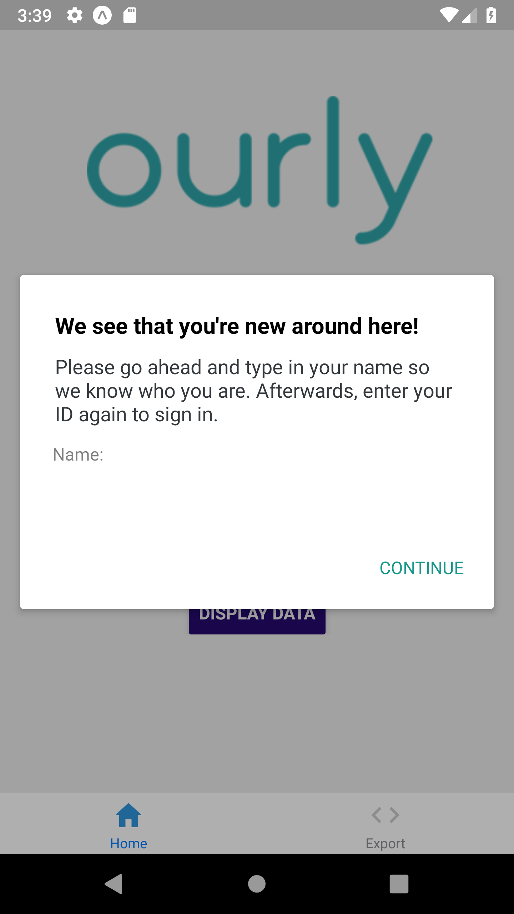
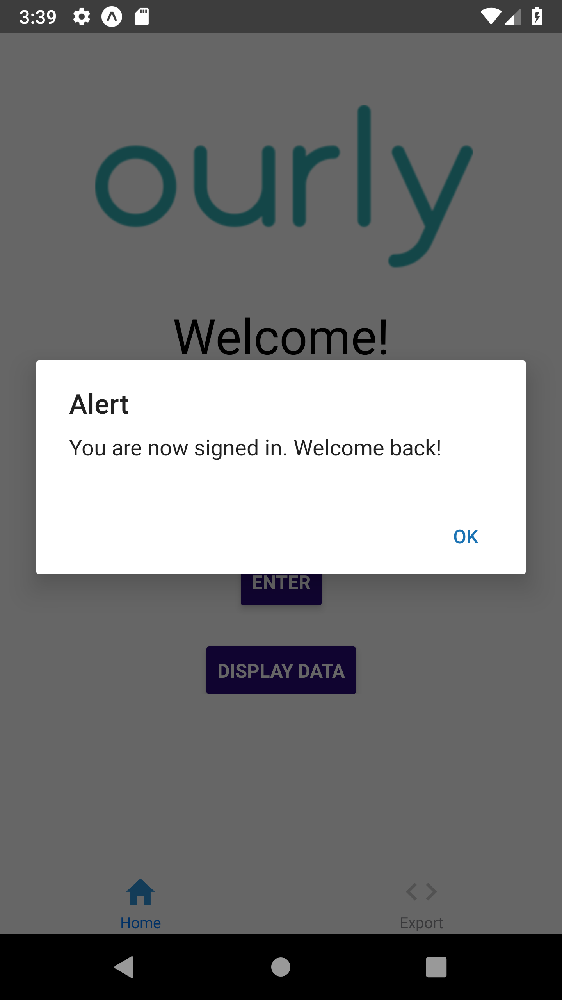
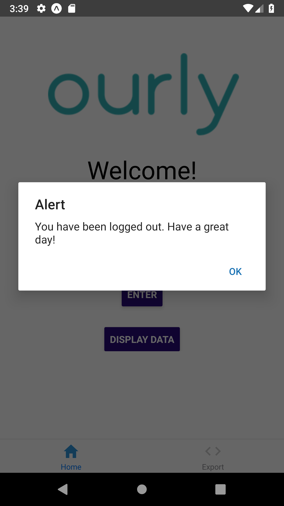
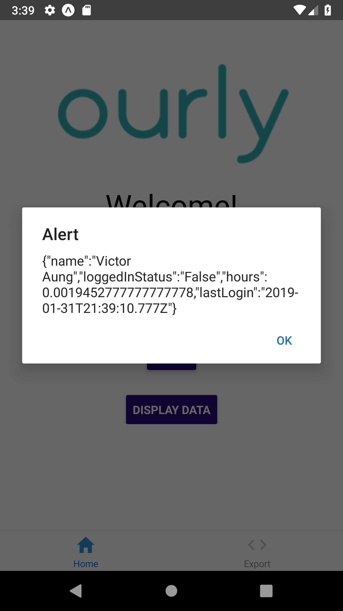
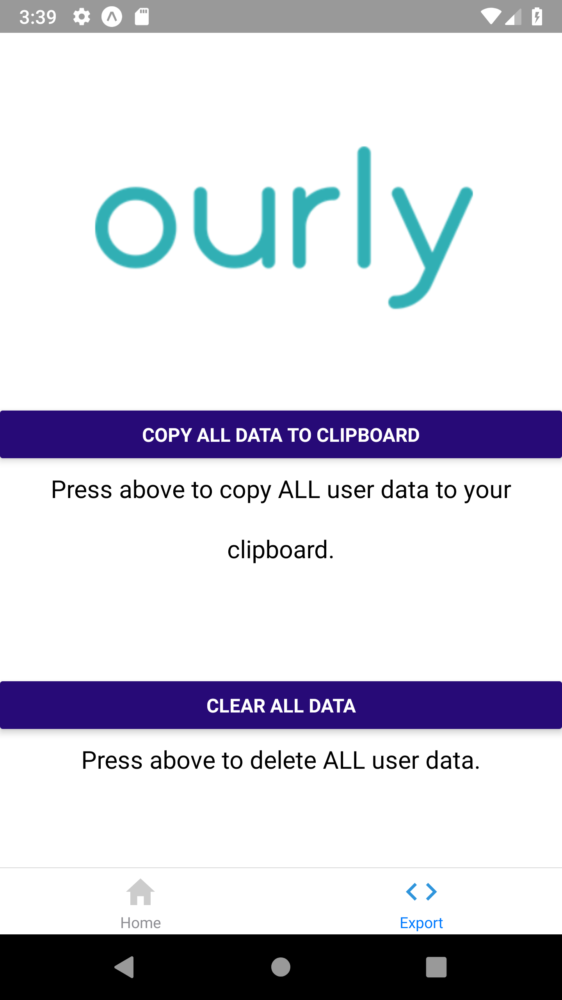
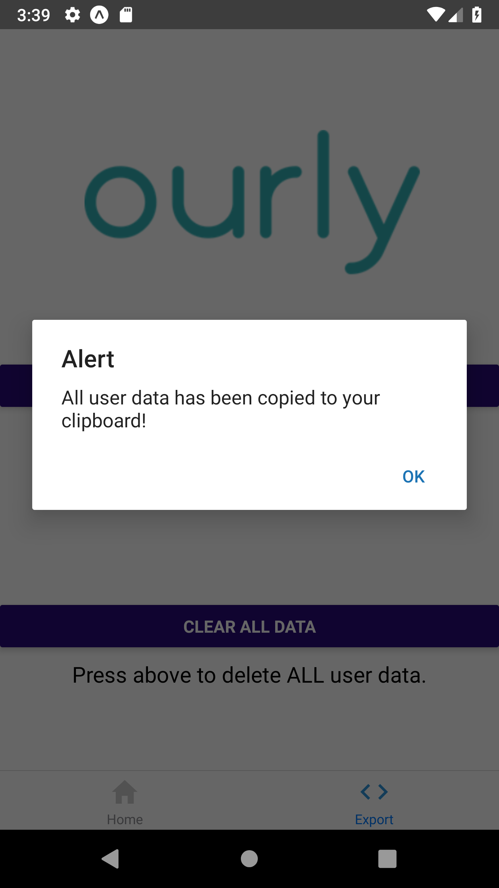
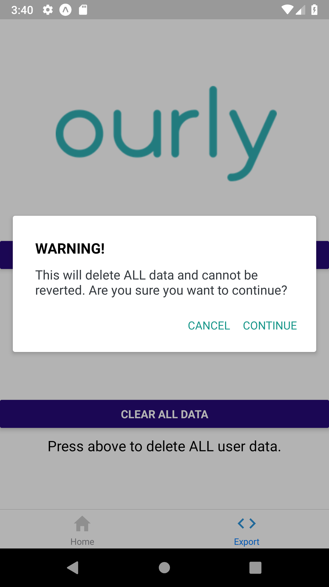

# Ourly
A simple timekeeping app to log hours. 

Created for the Northwestern Dance Marathon Tech Challenge 2019.

Made for Android and iOS using React Native.

See the Tech Challenge page [here!](https://github.com/garrettmatsuda/NUDM_Tech_Challenge)

### Problem Statement
Due to new regulations in the nonprofit industry CIS of Chicago’s employees must track their hours accurately.

## Solution
Our solution focuses on two key aspects of the problem: tracking hours easily and accurately. Users are able to sign in with their ID and our app will automaticlly track their hours until they sign out, providing precision timing of their hours. Ourly aims to be a physical timecard replacement app. It can also be used as a personal tracker - it's possible to track how much time you spend on different tasks. 

### How It Works

The landing screen is simple. The user is able to input their ID and then press enter to sign in.

 

When signing in, new users are prompted to provide their name to create an account. Old users will get an alert that affirms they have logged in. 

Users can sign out by inputting their ID and pressing enter again. Another alert will pop up that confirms they have logged out.

The User and Client will have the option to view the data in the system by clicking on "display data". This lists the users, their login status, how many hours they've worked, and when they last logged in. 

Our second screen gives our clients the option to copy and clear all the user information in the system. The app provides all user data in a CSV compatible format for an easy way to import to spreadsheets or other apps.

### Usage
We currently have our solution built and exported as an apk that can used on android emulators and devices. If you'd like to run it on iOS instead, install these: react, react-native, expo, and react-native-dialog. 

### Next Steps
Our next steps include: setting up a back end database instead of storing user information locally, having alternative sign in methods (QR codes), and putting our app on the iOS App Store and the Google Play Store.

## Devlopers
### Victor Aung
victoraung@u.northwestern.edu

### Paul Farcasanu
paulfarcasanu2021@u.northwestern.edu

### Hamilton Vuu
hamilton@u.northwestern.edu

